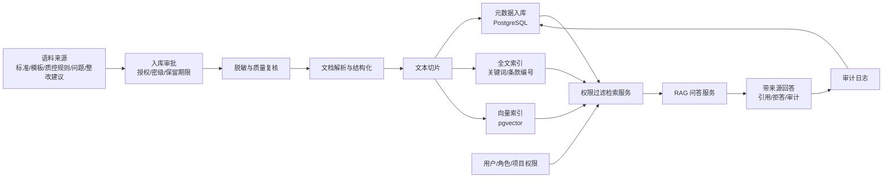
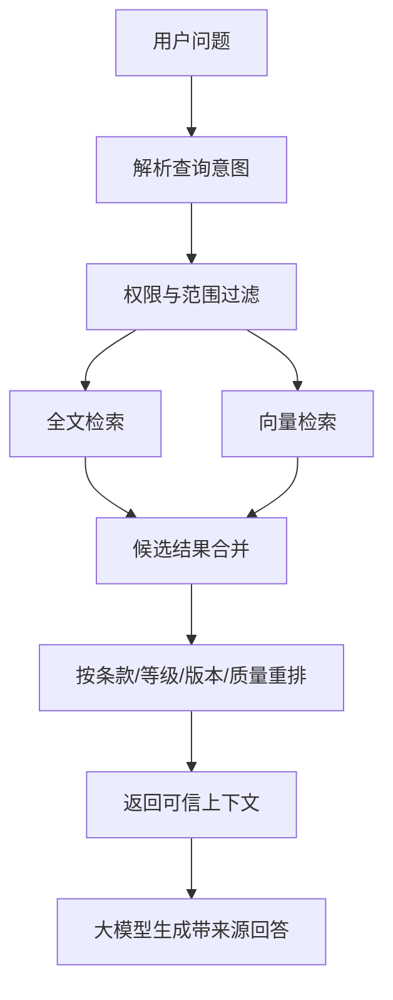

# 本地知识库底座技术栈与原理说明

编制日期：2026-07-06

适用场景：网络安全等级保护测评机构本地知识库 POC/MVP 建设，主要支撑标准条款检索、机构模板与质控规则管理、脱敏优秀问题库、整改建议推荐、带来源问答等能力。

## 1. 建设定位

本地知识库底座不是一个单纯的“文件搜索系统”，也不是直接把文档交给大模型回答。它应当是一个受权限、受审计、可追溯、可扩展的知识服务平台。

在等保测评机构场景下，底座要解决 5 个关键问题：

1. 资料分散：标准规范、模板、报告、问题台账、整改建议、质控规则分散在不同系统和文件夹中。
2. 查询困难：测评师需要快速定位标准条款、适用等级、测评依据和历史相似问题。
3. 经验难复用：优秀报告中的问题描述和整改建议没有结构化沉淀。
4. 安全要求高：历史报告、测评记录、截图、拓扑、IP、配置等可能涉及客户边界和敏感信息。
5. AI 输出需可控：回答必须带来源，不能编造，不能越权，不能泄露敏感内容。

因此，底座的核心设计原则是：

- 本地部署优先。
- 数据治理先于模型能力。
- 检索前权限过滤。
- 回答必须带来源。
- 先做轻量可控架构，再按数据量和复杂度升级。

## 2. 推荐技术栈

### 2.1 POC/MVP 最小技术栈

| 层级 | 推荐组件 | 作用 | 选择原因 |
|---|---|---|---|
| 操作系统 | Linux Server 或 Windows Server | 部署数据库、检索服务、模型服务和应用 | 兼容现有内网环境，便于本地化运维 |
| 主数据库 | PostgreSQL | 存储文档元数据、条款、问题、整改建议、权限、审计日志 | 成熟稳定、事务能力强、扩展生态好 |
| 向量检索 | pgvector | 存储文本向量并进行相似度检索 | 与 PostgreSQL 集成，降低基础设施复杂度 |
| 全文检索 | PostgreSQL Full Text Search 或轻量中文分词方案 | 支持关键词、条款编号、标准名称、专业术语检索 | 首期数据量不大，避免过早引入 OpenSearch 集群 |
| 文件存储 | 本地文件目录或 MinIO 单节点 | 存储原始文件、脱敏文件、解析结果 | 简单可控，便于本地备份和权限隔离 |
| 文档解析 | 本地 PDF/Word/Excel 解析工具 | 提取正文、表格、章节、页码 | 不把文件发往外部服务，降低泄露风险 |
| 向量模型 | 本地中文 Embedding 模型 | 将文本切片转换为向量 | 支撑语义相似检索 |
| 重排序模型 | 可选本地 Reranker | 对初步召回结果重新排序 | 提升条款和整改建议匹配准确率 |
| 大模型 | 本地或内网合规模型服务 | 基于检索结果生成回答 | 保证语料不出内网，回答可审计 |
| 后端服务 | Python FastAPI、Java Spring Boot 或现有技术栈 | 提供入库、检索、问答、权限、审计 API | 可按机构现有开发能力选择 |
| 前端界面 | Vue、React 或现有管理后台 | 提供检索、问答、语料审批、审计查看界面 | 便于测评师和知识管理员使用 |
| 认证授权 | 机构现有 SSO/RBAC 或本地 RBAC | 控制用户、角色、项目、数据范围 | 防止越权检索和越权查看 |
| 审计日志 | PostgreSQL 审计表 + 日志文件 | 记录查询、召回、生成、导出、审批行为 | 满足合规追溯和安全复盘 |

### 2.2 首期不建议引入的组件

| 组件 | 首期不建议原因 | 适合引入时机 |
|---|---|---|
| Milvus 集群 | 增加部署、维护、备份和权限同步复杂度 | 向量数据达到百万级以上，pgvector 性能不足时 |
| OpenSearch/Elasticsearch 集群 | 运维成本较高，中文分词和权限过滤需额外治理 | 全文检索规模大、并发高、复杂聚合需求明显时 |
| Neo4j/ArangoDB | 知识关系首期可用关系表表达 | 条款、问题、证据、整改、行业关系复杂后 |
| 多模态模型 | 图片证据、拓扑、截图敏感度高 | 图像脱敏和证据授权机制成熟后 |
| 大模型微调平台 | 训练数据授权和质量要求高 | RAG 无法满足需求且具备合规训练数据后 |
| 数据湖/湖仓平台 | POC 语料规模不需要 | 后续做全量项目分析、行业画像、风险趋势时 |

## 3. 总体架构

这个架构分为 6 个核心层：

1. 数据治理层：完成授权、分级、脱敏、质量复核。
2. 知识加工层：完成解析、结构化、切片、标签和条款映射。
3. 存储索引层：用 PostgreSQL 存元数据，用全文索引支持精确检索，用 pgvector 支持语义检索。
4. 权限控制层：在检索前按用户、角色、项目、密级、使用范围过滤。
5. RAG 服务层：将检索到的可信材料交给大模型生成回答。
6. 审计运营层：记录入库、检索、生成、导出和审批行为。

## 4. 核心工作原理

### 4.1 文档入库原理

文档入库不是简单上传文件，而是将非结构化资料转换成可检索、可授权、可追溯的知识对象。

流程如下：

1. 语料登记：记录来源、负责人、授权状态、密级、使用范围、保留期限、销毁要求。
2. 脱敏复核：识别客户名称、系统名称、IP、账号、漏洞细节、个人信息等敏感内容。
3. 文档解析：从 PDF、Word、Excel 中提取正文、标题、表格、页码、章节结构。
4. 结构化抽取：识别标准条款、测评项、问题描述、整改建议、复测要点、质控规则。
5. 文本切片：将长文档拆成语义完整的小片段，并保留来源和上下文。
6. 元数据写入：保存文档编号、版本、密级、项目、等级、适用范围、审批状态。
7. 索引生成：生成全文索引和向量索引。
8. 发布审核：由知识管理员或质量负责人确认后进入可检索状态。

### 4.2 全文检索原理

全文检索用于处理“明确关键词”场景，例如：

- `GB/T 22239-2019`
- `安全计算环境`
- `身份鉴别`
- `三级 等保 测评要求`
- `恶意代码防范`

它的基本原理是：

1. 将文本分词或拆成可检索词元。
2. 建立倒排索引，记录每个词出现在哪些文档和切片中。
3. 用户输入关键词后，快速找到包含这些词的内容。
4. 按匹配程度、字段权重、版本状态、权限范围进行排序。

全文检索的优势是精确、可解释、适合条款编号和专业术语；不足是对同义表达和语义相似问题不够敏感。

### 4.3 向量检索原理

向量检索用于处理“语义相似”场景，例如用户问：

- “三级系统管理员口令复杂度应该怎么查？”
- “没有定期审计日志算什么问题？”
- “防火墙策略长期未清理怎么写整改建议？”

这些问题不一定包含标准条款原文，但语义上可以匹配到相关条款、历史问题和整改建议。

向量检索的基本原理是：

1. 使用 Embedding 模型把文本切片转换成一组数字向量。
2. 用户问题也转换成向量。
3. 在向量库中计算用户问题与知识切片的相似度。
4. 返回语义最接近的条款、问题样本或整改建议。

向量检索的优势是能理解近义表达、自然语言问题和经验类知识；不足是结果不如关键词检索直观，因此必须结合元数据过滤、全文检索和来源引用。

### 4.4 混合检索原理

等保知识库不应只依赖向量检索。推荐采用“全文检索 + 向量检索 + 元数据过滤 + 可选重排序”的混合检索。

混合检索适合等保场景，因为：

- 标准编号、条款名称适合全文检索。
- 自然语言问题适合向量检索。
- 等级、行业、项目、密级必须依赖元数据过滤。
- 质量较高、现行有效、已复核的内容应优先排序。

### 4.5 RAG 问答原理

RAG 是 Retrieval-Augmented Generation，即“检索增强生成”。它不是让大模型凭记忆回答，而是先从本地知识库中检索可信材料，再让模型基于材料组织答案。

RAG 流程如下：

1. 用户提出问题。
2. 系统识别用户身份、角色和可访问范围。
3. 检索服务只在授权范围内查找相关条款、模板、问题和整改建议。
4. 将检索结果、来源信息、回答规则交给大模型。
5. 大模型只能基于检索材料回答。
6. 输出答案时附带来源、条款、文档、版本或样本编号。
7. 如果检索不到依据，系统应拒答或提示“知识库中未找到可确认依据”。
8. 全过程写入审计日志。

### 4.6 权限控制原理

权限控制必须发生在检索前，而不是回答后再隐藏结果。

错误方式：

1. 先从全部知识中向量召回。
2. 再过滤展示结果。
3. 大模型可能已经看到无权限内容，存在泄露风险。

正确方式：

1. 根据用户身份得到可访问范围。
2. 在 SQL 查询和向量查询时加入权限条件。
3. 只从授权范围内召回候选内容。
4. 大模型只能看到授权内容。

推荐的权限过滤字段：

| 字段 | 作用 |
|---|---|
| tenant_id | 区分机构、部门或租户。 |
| project_id | 控制项目级资料访问。 |
| client_id | 控制客户边界。 |
| confidentiality_level | 控制 P0/P1/P2/P3/P4 密级。 |
| usage_scope | 控制通用知识、机构内部、项目内、禁止复用。 |
| approval_status | 只允许召回已审批通过内容。 |
| effective_status | 只默认召回现行有效内容。 |
| role_scope | 控制测评师、审核人、管理员等角色差异。 |

### 4.7 审计追溯原理

审计日志用于回答“谁在什么时候问了什么、系统检索了哪些材料、模型输出了什么、是否导出”的问题。

建议记录：

- 用户 ID、角色、部门。
- 查询时间、查询问题、查询来源系统。
- 检索条件、权限范围、召回文档和切片 ID。
- 模型名称、模型版本、提示词模板版本。
- 输出内容、引用来源、拒答原因。
- 是否复制、下载、导出。
- 异常行为，例如越权尝试、提示词注入、敏感词触发。

审计的价值不只是合规，也是后续优化知识库的重要依据。

## 5. 核心数据模型

### 5.1 文档表

用于记录每份标准、模板、制度、问题来源文件。

关键字段：

- doc_id
- title
- source_type
- version
- effective_status
- confidentiality_level
- usage_scope
- owner
- approval_status
- retention_period
- destruction_requirement
- created_at
- updated_at

### 5.2 切片表

用于保存可检索的文本片段。

关键字段：

- chunk_id
- doc_id
- section_path
- page_no
- chunk_text
- text_hash
- clause_id
- system_level
- control_domain
- sensitivity_tags
- approval_status
- embedding_vector

### 5.3 标准条款表

用于结构化管理等保条款。

关键字段：

- clause_id
- standard_no
- standard_name
- standard_version
- chapter
- clause_no
- clause_title
- clause_text
- applicable_level
- control_domain
- assessment_object
- effective_status

### 5.4 问题与整改建议表

用于沉淀优秀问题和整改建议。

关键字段：

- finding_id
- finding_title
- finding_description
- risk_description
- related_clause_id
- system_level
- control_domain
- scenario_tags
- remediation_id
- remediation_text
- retest_points
- source_project_type
- quality_score
- reviewer

### 5.5 权限与审计表

用于控制访问和追踪行为。

关键字段：

- user_id
- role_id
- project_scope
- data_scope
- query_id
- retrieved_chunk_ids
- answer_text
- citation_ids
- action_type
- created_at

## 6. 为什么首期推荐 PostgreSQL + pgvector

### 6.1 架构更轻

PostgreSQL 同时承担元数据、权限、审计、全文检索和向量检索能力，POC 阶段不需要额外维护多套基础设施。

这对等保机构尤其重要，因为首期难点不是海量并发，而是数据治理、授权闭环、脱敏复核、条款结构化和评测验证。

### 6.2 权限更容易做对

如果元数据在 PostgreSQL，向量在 Milvus，全文索引在 OpenSearch，权限过滤就需要在多套系统之间同步，容易出现不一致。

使用 PostgreSQL + pgvector 可以在同一条查询链路里同时处理：

- 用户角色。
- 项目范围。
- 客户范围。
- 数据密级。
- 审批状态。
- 标准版本。
- 向量相似度。

这有利于实现“检索前过滤”。

### 6.3 审计更完整

查询、召回、回答、引用、导出都可以和业务元数据放在同一个事务体系中管理，便于追踪和复盘。

例如一次问答可以记录：

- 用户问题。
- 权限过滤条件。
- 召回切片。
- 使用的条款。
- 输出答案。
- 引用来源。
- 是否触发敏感规则。

### 6.4 运维成本低

POC 阶段通常只有几万到几十万条切片，PostgreSQL + pgvector 足以支撑验证。

相比同时部署 Milvus、OpenSearch、Neo4j，单 PostgreSQL 路线更容易：

- 备份。
- 恢复。
- 权限管理。
- 数据迁移。
- 内网部署。
- 安全加固。

### 6.5 便于后续平滑升级

轻量架构不是放弃扩展，而是把边界设计清楚。

后续如果数据量和并发上升，可以逐步升级：

- 向量检索压力上升：迁移到 Milvus。
- 全文检索复杂度上升：引入 OpenSearch。
- 知识关系复杂：引入 Neo4j。
- 文件规模变大：升级 MinIO 集群。
- 问答并发上升：独立模型推理服务和队列。

只要保留统一的元数据、权限标签和知识对象 ID，升级不会推翻前期成果。

## 7. 技术栈优点分析

### 7.1 安全可控

- 语料、索引、模型和日志均可部署在本地或内网。
- 不需要将客户资料、报告内容、问题台账发送给公网服务。
- 支持按项目、客户、密级、角色做检索前过滤。
- 可记录完整审计链路。

### 7.2 适合等保知识特点

等保知识既有强结构内容，也有经验性内容。

- 标准条款、条款编号、等级要求适合结构化表和全文检索。
- 历史问题、整改建议、自然语言问答适合向量检索。
- 报告模板、质控规则适合版本管理和规则检索。
- 条款、问题、整改建议之间的关联可先用关系表表达。

### 7.3 成本和复杂度适中

首期最容易失败的点不是模型能力，而是系统过重、治理跟不上、权限做不细。

轻量技术栈的优点是：

- 部署快。
- 问题定位简单。
- 团队容易掌握。
- 试点周期短。
- 技术债可控。

### 7.4 结果可解释

通过全文检索、元数据过滤和来源引用，可以解释：

- 为什么召回这条标准。
- 为什么推荐这个整改建议。
- 它来自哪份文件、哪个章节、哪个版本。
- 是否为现行有效内容。
- 是否经过审核。

这比“模型直接回答”更适合测评机构质量管理要求。

### 7.5 有利于质量闭环

系统可以记录用户是否采纳回答、是否修改整改建议、是否认为引用错误。

这些反馈可以反向优化：

- 条款映射。
- 切片策略。
- 检索权重。
- 整改建议库。
- 质控规则。
- 评测集。

## 8. 与重型架构对比

| 维度 | PostgreSQL + pgvector 轻量底座 | Milvus + OpenSearch + Neo4j 重型架构 |
|---|---|---|
| 部署复杂度 | 低，适合 POC/MVP | 高，需要更多运维能力 |
| 权限一致性 | 容易统一控制 | 多系统同步权限，复杂度高 |
| 审计追踪 | 容易集中记录 | 需要跨系统关联日志 |
| 性能上限 | 中等，适合首期验证 | 高，适合大规模生产 |
| 成本 | 低 | 中高 |
| 扩展性 | 可逐步升级 | 初始能力强但起步重 |
| 适用阶段 | POC、MVP、早期生产 | 大规模生产、复杂知识图谱 |
| 主要风险 | 后期规模上来需拆分 | 前期治理未成熟时复杂度过高 |

结论：首期应优先选择轻量底座，先验证业务价值、安全边界和治理流程；当数据规模、并发量、检索复杂度明确增长后，再引入专用组件。

## 9. 本地知识库问答示例流程

用户问题：

“三级系统没有定期审计管理员操作日志，应该关联哪个测评要求，整改建议怎么写？”

系统处理流程：

1. 判断用户身份：该用户是测评师，只能访问通用知识和本项目授权数据。
2. 查询过滤：只检索已审批、已脱敏、可通用复用、现行有效的条款和问题样本。
3. 全文检索：匹配“三级”“审计”“管理员操作日志”等关键词。
4. 向量检索：召回语义相似的历史问题和整改建议。
5. 重排序：优先返回三级、管理中心或安全计算环境相关、质量评分高的样本。
6. 生成回答：基于召回材料总结测评依据、问题描述和整改建议。
7. 附带来源：列出标准编号、条款、内部问题样本编号、整改建议编号。
8. 记录审计：保存问题、召回内容、回答、引用、用户和时间。

输出要求：

- 不应编造条款。
- 不应输出客户真实名称或 IP。
- 不应把历史样本当作正式结论。
- 应提示“需结合现场证据和报告审核要求确认”。

## 10. 部署形态建议

### 10.1 单机 POC

适合 4 至 6 周验证。

部署内容：

- PostgreSQL + pgvector。
- 文件目录或 MinIO 单节点。
- 文档解析服务。
- 检索问答后端。
- 本地或内网模型服务。
- 简单 Web 界面。

优点：

- 部署快。
- 成本低。
- 便于演示和评测。

限制：

- 高可用能力弱。
- 并发能力有限。
- 需要后续迁移到生产架构。

### 10.2 内网 MVP

适合部门试点。

部署内容：

- PostgreSQL 主备或定期备份。
- MinIO 或文件服务器。
- 独立后端服务。
- 与统一身份认证或账号体系对接。
- 审计日志和基础监控。

优点：

- 可支撑真实试点。
- 权限和审计更完整。
- 具备进入生产的基础。

### 10.3 生产增强

适合全机构推广。

可扩展内容：

- PostgreSQL 高可用。
- OpenSearch 集群。
- Milvus 集群。
- MinIO 集群。
- 模型推理服务集群。
- 统一运维监控。
- 与报告智审、zysystem、ProjectMa 深度集成。

## 11. 后续扩展路线

### 阶段一：轻量本地知识库

范围：

- 标准条款。
- 模板和质控规则。
- 脱敏问题库。
- 整改建议库。
- 带来源问答。

技术重点：

- PostgreSQL + pgvector。
- 权限过滤。
- 审计日志。
- 本地 RAG。

### 阶段二：测评业务集成

范围：

- 报告智审依据查询。
- 测评辅助智能体查询。
- zysystem 脱敏记录导入。
- ProjectMa 项目台账只读同步。

技术重点：

- API 网关。
- 统一身份认证。
- 项目级权限同步。
- 数据同步任务。

### 阶段三：报告质检与辅助编写

范围：

- 报告一致性检查。
- 条款引用检查。
- 问题和整改建议闭环检查。
- 报告草稿片段辅助。

技术重点：

- 规则引擎。
- 报告结构化解析。
- 人工采纳反馈。
- 质量看板。

### 阶段四：大规模知识平台

范围：

- 全量历史资料治理后入库。
- 图片证据脱敏和 OCR。
- 知识图谱。
- 行业风险画像。
- 标准变更影响分析。

技术重点：

- Milvus/OpenSearch/Neo4j。
- 多模态解析。
- 数据湖或分析平台。
- 模型评测和持续优化。

## 12. 总结

等保测评机构建设本地知识库，首期不应追求“模型最强”或“架构最全”，而应优先把数据、权限、来源和审计做扎实。

推荐底座是：

- PostgreSQL 管理元数据、权限、审计和结构化知识。
- pgvector 支撑语义检索。
- 全文检索支撑标准编号、条款、专业术语检索。
- 本地文档解析和本地/内网模型服务保障数据不出域。
- RAG 机制保证回答来自授权知识并带来源。
- 审计和拒答机制控制安全风险。

这套方案的最大优点是轻量、可控、可审计、可扩展，适合从 4 至 6 周 POC 起步，并能平滑演进到后续 MVP 和生产系统。

